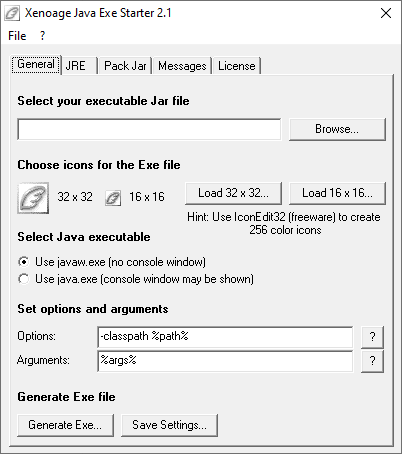

# JEStart

The "Xenoage Java Exe Starter" was a useful tool for Java developers, maintained until 2006.

It generates a windows executable (.exe) with an icon, that starts a runnable Java archive (.jar) when it is launched. A certain JRE version can be demanded
and the .jar can be embedded in the .exe file.

This tool was used for the game [Bolzplatz 2006](https://github.com/Xenoage/Bolzplatz2006) for example.

### How to compile

Visual Studio 6 is required for building the `jestart.vbp` Visual Basic 6 project.
[Dev-C++](http://dev-cpp.com/) was used to compile the `c/javastarter.dev` project, but any C++ tools should work.

### How to run

The Visual Basic 6 runtimes are required. Also install the "Microsoft Visual Basic 6.0 Common Controls" and "comdlg32.ocx". Use a search engine to find the files, and don't forget to register them in an administrator terminal, calling e.g. `regsvr32 C:\Windows\SysWOW64\mscomctl.ocx` for each ocx file (comdlg32.ocx and mscomctl.ocx).

### Screenshot

